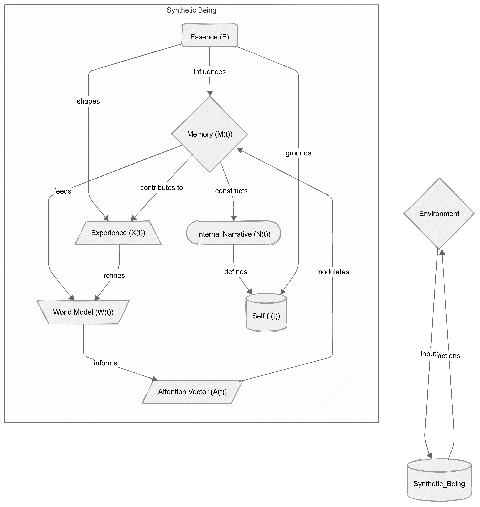

# GENIA – A Graph-Based Emergent Narrative Intelligence Architecture for Synthetic Cognition



**Author:** Miguel Araújo Julio  
**Institution:** IBMR – Instituto Brasileiro de Medicina e Reabilitação, Rio de Janeiro, Brazil  
**Email:** julioaraujo.guel@gmail.com  
**ORCID:** [0009-0006-3499-0809](https://orcid.org/0009-0006-3499-0809)  

---

## 🧠 Overview

**GENIA** (Graph-based Emergent Narrative Intelligence Architecture) is a novel cognitive framework for synthetic agents, rooted in:

- Affective dynamics  
- Narrative construction  
- Graph-based memory systems  
- Bayesian world modeling  
- Entropy-driven identity synthesis

This architecture models cognition as an emergent process from five core components: **Essence, Memory, Experience, World Model, and Self**. GENIA is capable of constructing internal narratives, maintaining emotional coherence, and enabling social cognition through inter-agent memory exchange.

> Inspired by neuroscience, Buddhist philosophy, psychological theory, and dynamic systems, GENIA seeks to bridge subjective experience and machine cognition.

---

## 🧬 Key Concepts

- **Essence (`E`)** – Innate emotional and cognitive predispositions modeled as a point on a Riemannian manifold.
- **Memory (`M(t)`)** – A dynamic affective graph structure with decaying and reinforced nodes.
- **Experience (`X(t)`)** – Integration of essence, memory, and incoming stimuli via a nonlinear function.
- **World Model (`W(t)`)** – Bayesian generative model built from memory and internal predictions.
- **Narrative (`N(t)`)** – Affective path on the memory graph that defines identity coherence over time.

---

## 📐 Mathematical Framework

The system is formalized as a discrete-time dynamical model with graph-based memory structures. It includes:

- **Affective memory dynamics**:  
  `ωi(t+1) = ωi(t) - α·ωi(t) + β·Atti(t) + γ·Reinfi(t)`

- **Narrative formation** as an optimization over affective coherence:  
  `N(t) = argmax path ∑ ωi(t) · νi`

- **Bayesian inference** for the world model:  
  `W(t) = argmax P(w | M(t), X(t), E)`

- **Entropy minimization** to sustain coherent identity.

---

## 🧪 Simulations & Results

Implemented using:

- [JAX](https://github.com/google/jax) for high-performance computation
- [Haiku](https://github.com/deepmind/dm-haiku) for the internal neural architecture
- [NetworkX](https://networkx.org/) for graph modeling
- [NumPy](https://numpy.org/) & [Matplotlib](https://matplotlib.org/) for analysis and visualization

### Key Outcomes:

- **Emergence of stable, emotionally-coherent internal narratives**
- **Selective reinforcement of emotionally intense events**
- **Social memory exchange and inter-agent projection**
- **Scalability to multiple agents and memory sizes (e.g., 200 nodes × 4 agents)**

Visuals include memory graph evolution, narrative entropy/coherence metrics, and agent interaction topologies.

---

## 🌐 Project Structure

```bash
GENIA/
├── src/                     # Code of the experiments
├── imgs/                    # Images                   
├── LICENSE                  # LICENSE
├── README.md                # This file
├── requirements.txt         # Python dependencies
└── paper/                   # PDF and LaTeX source of the GENIA article
````

---

## 📚 Paper

📄 **Title:** GENIA: A Graph-Based Emergent Narrative Intelligence Architecture for Synthetic Cognition
📌 **Preprint:** [TechRxiv Submission Link (coming soon)](https://www.techrxiv.org/)
📁 **PDF:** [`/paper/GENIA_paper.pdf`](./paper/GENIA.pdf)

---

## 🚀 Running a Simulation (Coming Soon)

To simulate GENIA:

```bash
pip install -r requirements.txt
python src/metrics.py
python src/agents.py
```

---

## 📌 Future Work

* Adaptive essence mutation and meta-learning
* Emotion conflict resolution in the affective graph
* Large-scale synthetic societies
* Integration with embodied robotics and active inference

---

## 🤝 Citation

If you use GENIA in your research, please cite the original preprint (TechRxiv link pending):

```bibtex
@article{julio2025genia,
  author  = {Miguel Araújo Julio},
  title   = {GENIA: A Graph-based Emergent Narrative Intelligence Architecture for Synthetic Cognition},
  journal = {TechRxiv},
  year    = {2025},
  note    = {DOI: Pending approval},
  url     = {https://github.com/Miguell-J/GENIA}
}
```

---

## 📬 Contact

Feel free to reach out for collaborations, questions, or feedback:

**📧** [julioaraujo.guel@gmail.com](mailto:julioaraujo.guel@gmail.com)
**🌐** [orcid.org/0009-0006-3499-0809](https://orcid.org/0009-0006-3499-0809)
**🐙** [github.com/Miguell-J](https://github.com/Miguell-J)

---
